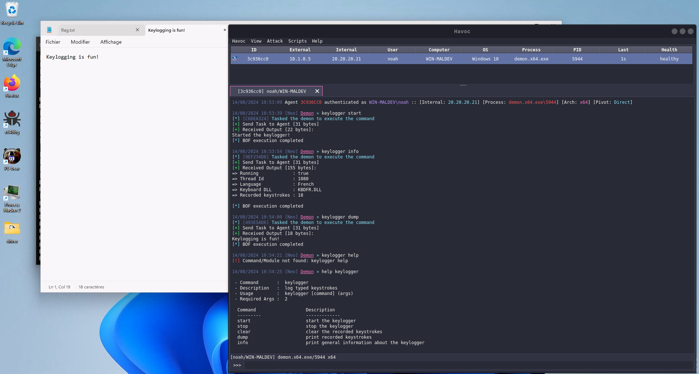

# Keylogger

> Beacon Object File (BOF) for [Havoc](https://github.com/HavocFramework/Havoc) that logs keystrokes.

## Showcase

## WARNING

This project is not finished and so there are bugs that make the implant crash.

## Credits

- [Synacktiv's dev team](https://www.synacktiv.com/en/publications/writing-a-decent-win32-keylogger-23) for publishing a really cool series
  of post about keylogging. My code is just a re-write of their [keepcap](https://github.com/synacktiv/keebcap) project, all credits go to
  the synacktiv dev team.