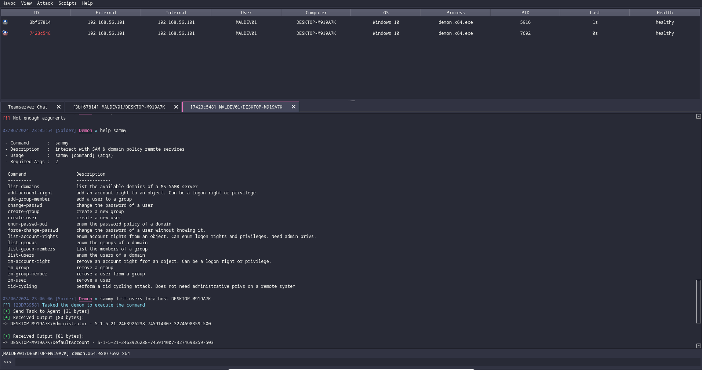

# Sammy

> Beacon Object File (BOF) for [Havoc](https://github.com/HavocFramework/Havoc) that interacts with SAM & domain policy remote services.

## Showcase

## Credits

- [James Forshaw](https://twitter.com/tiraniddo) for writing the Windows Security Internals book and making the NtObjectManager powershell module
- [Maldev Academy](https://maldevacademy.com) for making a very comprehensive module about BOFs
- [5pider](https://twitter.com/C5pider) for making Havoc & writing the BOFs modules on Maldev Academy
- [ReactOS](https://reactos.org/) for documenting Samlib.dll exported functions
