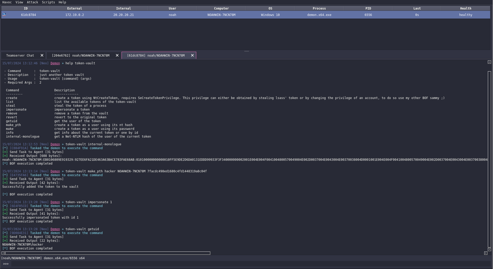

# Token Vault

> Beacon Object File (BOF) for [Havoc](https://github.com/HavocFramework/Havoc) that manages token.

## Showcase

## WARNING

This project is not meant to replace havoc's builtin token module, I just did that bof for fun & learning purposes. I suggest you use havoc's default token module as it is more stable.

This project is not finished and there probably are memory leaks and you might encounter crashes.

The "token create" command isn't stable and I suggest you not to use it.

## TODO
* Internal-Monologue -> Switch to Net-NTLMv1 using regkey
* Token make_pth -> bypass UAC using regkey
* adjust privileges (disable/enable groups/privs) using NtAdjustPrivilegeToken/NtAdjustGroupsToken

## Credits

- [James Forshaw](https://twitter.com/tiraniddo) for writing the Windows Security Internals book and making the NtObjectManager powershell module
- [Maldev Academy](https://maldevacademy.com) for making a very comprehensive module about BOFs
- [5pider](https://twitter.com/C5pider) for making Havoc & writing the BOFs modules on Maldev Academy
