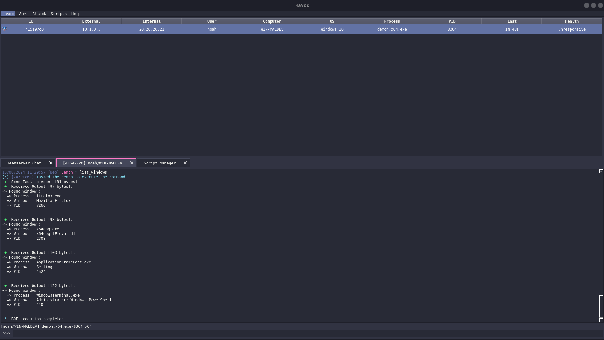

# Windows

> Beacon Object File (BOF) for [Havoc](https://github.com/HavocFramework/Havoc) that lists windows.

## Showcase

## Description

This bof can be used to list windows visible on a user screen. Did it mostly for fun, havoc already has that functionality, however it does
print the PID and process name of the windows.

